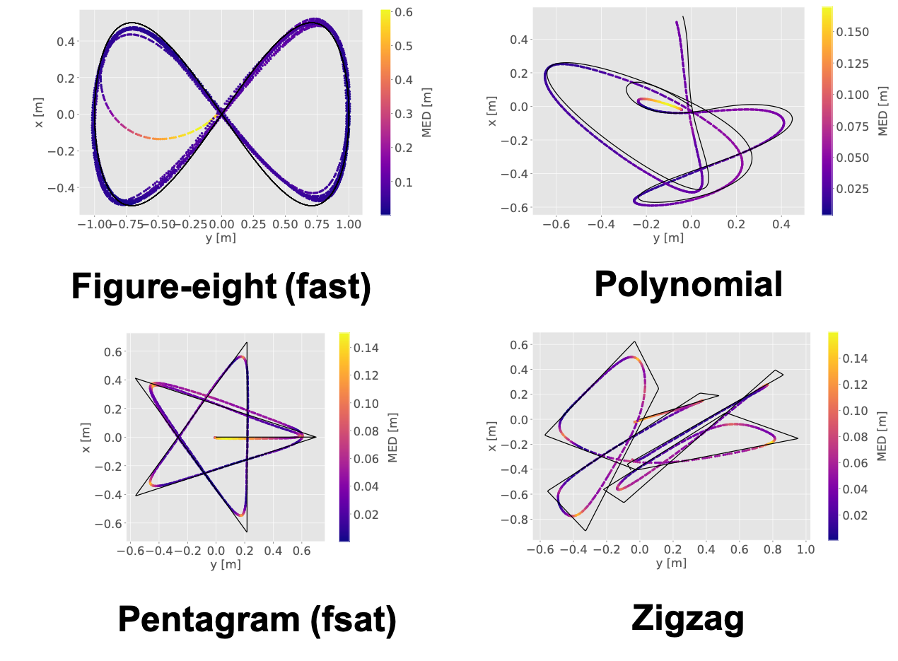

# What Matters in Learning A Zero-Shot Sim-to-Real RL Policy for Quadrotor Control? A Comprehensive Study 

<div align="center">

[[Website]](https://sites.google.com/view/simpleflight/)
[[arXiv]](http://arxiv.org/abs/2412.11764)
[[Firmware Code]](https://github.com/thu-uav/crazyswarm_SimpleFlight)


</div>

[](https://opensource.org/licenses/MIT)

Jiayu Chen, Chao Yu, Yuqing Xie, Feng Gao, Yinuo Chen, Shu’ang Yu, Wenhao Tang, Shilong Ji, Mo Mu, Yi Wu, Huazhong Yang, Yu Wang

This is the official repository of the paper "What Matters in Learning A Zero-Shot Sim-to-Real RL Policy for Quadrotor Control? A Comprehensive Study ". This repository is heavily based on https://github.com/btx0424/OmniDrones.git.

<div align=center>

</div>

Overview of SimpleFlight. We begin with SysID and selective DR for quadrotor dynamics and low-level control. Next, an RL policy is trained in simulation to output CTBR for tracking arbitrary trajectories and zero-shot deployed directly on a real quadrotor. The training framework focuses on three key aspects, i.e., input space design, reward design, and training techniques, identifying five critical factors to enhance zero-shot deployment.

## Install

#### 1. Download Isaac Sim (local version)

Download the [Omniverse Isaac Sim (local version)](https://developer.nvidia.com/isaac-sim) and install the desired Isaac Sim release **(version 2022.2.0)** following the [official document](https://docs.omniverse.nvidia.com/isaacsim/latest/installation/install_workstation.html). *Note that Omniverse Isaac Sim supports multi-user access, eliminating the need for repeated downloads and installations across different user accounts.*

Set the following environment variables to your ``~/.bashrc`` or ``~/.zshrc`` files :

```
# Isaac Sim root directory
export ISAACSIM_PATH="${HOME}/.local/share/ov/pkg/isaac_sim-2022.2.0"
```

*(Currently we use isaac_sim-2022.2.0. Whether other versions can work or not is not guaranteed. We provide a .zip flie for [isaac_sim-2022.2.0](https://drive.google.com/file/d/1ZrfhIkQVdRynthJ2FqGBC5jA93J6yEiZ/view?usp=sharing). For easy usage, we also provide a [guide](https://github.com/thu-uav/Multi-UAV-pursuit-evasion/issues/1#issuecomment-2573176995) on the correct usage of Isaac Sim 2022.)*

After adding the environment variable, apply the changes by running:
```
source ~/.bashrc
```

#### 2. Conda

Although Isaac Sim comes with a built-in Python environment, we recommend using a seperate conda environment which is more flexible. We provide scripts to automate environment setup when activating/deactivating a conda environment at ``SimpleFlight/conda_setup``.

```
conda create -n sim python=3.7
conda activate sim

# at SimpleFlight/
cp -r conda_setup/etc $CONDA_PREFIX
# re-activate the environment
conda activate sim
# install
pip install -e .

# verification
python -c "from omni.isaac.kit import SimulationApp"
# which torch is being used
python -c "import torch; print(torch.__path__)"
```

#### 3. Third Party Packages
SimpleFlight requires specific versions of the `tensordict` and `torchrl` packages. For the ``deploy`` branch, it supports `tensordict` version 0.1.2+5e6205c and `torchrl` version 0.1.1+e39e701. 

We manage these two packages using Git submodules to ensure that the correct versions are used. To initialize and update the submodules, follow these steps:

Get the submodules:
```
# at SimpleFlight/
git submodule update --init --recursive
```
Pip install these two packages respectively:
```
# at SimpleFlight/
cd third_party/tensordict
pip install -e .
```
```
# at SimpleFlight/
cd third_party/torchrl
pip install -e .
```
#### 4. Verification
```
# at SimpleFlight/
cd scripts
python train.py headless=true wandb.mode=disabled total_frames=50000 task=Hover
```

#### 5. Working with VSCode

To enable features like linting and auto-completion with VSCode Python Extension, we need to let the extension recognize the extra paths we added during the setup process.

Create a file ``.vscode/settings.json`` at your workspace if it is not already there.

After activating the conda environment, run

```
printenv > .vscode/.python.env
``````

and edit ``.vscode/settings.json`` as:

```
{
    // ...
    "python.envFile": "${workspaceFolder}/.vscode/.python.env",
}
```

## Usage 
This repo contains the simulation code for training our tracking policy. For running on the real Crazyflie, see the code here: https://github.com/thu-uav/crazyswarm_SimpleFlight. Weights of our tracking policy can be found in ``/SimpleFlight/models/deploy.pt``

The code is organized as follow:
```
cfg
|-- train.yaml
|-- algo
    |-- mappo.yaml
|-- task
    |-- Track.yaml
    |-- Hover.yaml
omni_drones
|-- envs
    |-- single
        |-- hover.py
        |-- track.py
scripts
|-- train.py
|-- eval.py
```

For policy training, 
```
# at SimpleFlight/
cd scripts
python train.py
```
Modifying training parameters via train.yaml
- `run_name` : the name of the training projects
- `defaults` `-task` : the name of the task.
- `mode` : online means that using wandb to visualize the training process

For policy evaluation,
```
python eval.py
```

For Track, modifying task parameters via Track.yaml
- `env` `num_envs` : the number of parallel environments
- `env` `max_episode_length` : the maximum length of an episode
- `use_eval`: set True to eliminate the randomness of the environment  for evaluation
- `eval_traj`: types of evaluation trajectories 
- `action_transform`: the low-level controller that converts CTBR commands to motor thrusts. use `PIDrate` for crazyflie

## Real-world Deployment
We deploy the policy on real [CrazyFlie 2.1](https://www.bitcraze.io/products/old-products/crazyflie-2-1/) quadrotors. The key parameters of dynamics model is listed as follow:
```
# in crazyflie.yaml
mass: 0.0321
inertia:
  xx: 1.4e-5
  xy: 0.0
  xz: 0.0
  yy: 1.4e-5
  yz: 0.0
  zz: 2.17e-5
force_constants: 2.350347298350041e-08
max_rotation_velocities: 2315
moment_constants: 7.24e-10
time_constant: 0.025
```

Note that we use Weights & Bias as the defaul visualizattion platform; to use Weights & Bias, please register and login to the platform first.

<!-- <div align=center>


</div> -->

## Citation
please cite [our paper](http://arxiv.org/abs/2412.11764
) if you find it useful:

```
@misc{chen2024matterslearningzeroshotsimtoreal,
      title={What Matters in Learning A Zero-Shot Sim-to-Real RL Policy for Quadrotor Control? A Comprehensive Study}, 
      author={Jiayu Chen and Chao Yu and Yuqing Xie and Feng Gao and Yinuo Chen and Shu'ang Yu and Wenhao Tang and Shilong Ji and Mo Mu and Yi Wu and Huazhong Yang and Yu Wang},
      year={2024},
      eprint={2412.11764},
      archivePrefix={arXiv},
      primaryClass={cs.RO},
      url={https://arxiv.org/abs/2412.11764}, 
}
```
